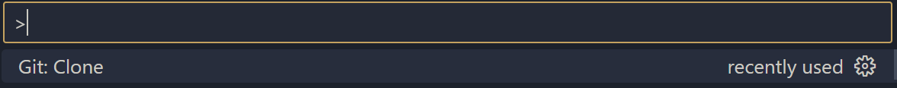
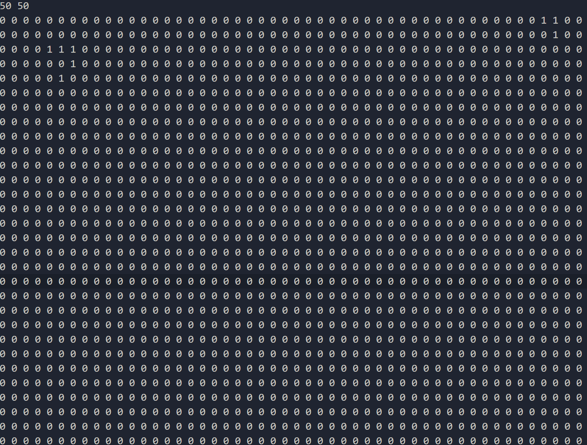

# 🟠JEU DE LA VIE🟠

## CONTEXTE :

Le jeu de la vie est un automate cellulaire proposé par le mathématicien John Conway. Il permet de suivre l’évolution d’une population de cellules au cours du temps. Ces cellules sont dans une grille en deux dimensions et chaque cellule peut avoir deux états, soit vivante, soit morte.  
Le temps va être appelé itération et chaque cellule change d’état selon ce temps.

Pour cela deux règles définissent le jeu de la vie :

- Une cellule morte possédant exactement trois voisines devient vivante.

- Une cellule vivante possédant deux ou trois voisines vivantes reste vivante, sinon elle meurt.

## SOMMAIRE :

- [DOCUMENTATION UTILISATEUR](#documentation-utilisateur-)
- [DOCUMENTATION TECHNIQUE](#documentation-technique-)

## DOCUMENTATION UTILISATEUR :

### Comment implémenter le programme ?

Pour impléter le programme, il faut le télécharger ou le cloner.

#### Télécharger le programme :

Maintenant, il faut déziper le dossier et ajouter manuellement les fichiers dans le dossier que vous souhaité.

Vous avez maintenant accès au programme.

#### Cloner le programme sur VSCODE:

1 - Connectez vous à GITHUB sur VSCODE.

2 - Copié collé ce lien :

3 - Faite CTRL SHIFT P sur VSCODE et séléctioner "GIT : CLONE".

4 - Séléctionner "Clone From GITHUB".

5 - Coller le lien :

6 - Puis choissisez le répertoire où vous souhaité cloner le programme.

### Comment executer le programme ?

Pour executer le programme, il faut suivre de nombres étapes.

#### Ajoutez / Modifier un fichier d'entrée :

- Dans le dossier, il existe par défaut un fichier "test.txt" comprenant une matrice en 50x50.

- Vous pouvez modifier cette matrice comme vous voulez, la première ligne correspond aux dimensions et la deuxième,troisième... C'est le contenu de la matrice.

- Pensez à faire correspondre les dimensions aux nombres d'entiers que vous avez ajouter et à rentrer seulement des 1 ou 0 sinon la matrice n'est pas valide.

- Vous pouvez créer votre propre fichier texte.

#### Installer la bibliothèque SFML :

- Cette bibliothèque est obligatoire pour le fonctionnement de l'interface graphique.

Pour Ubuntu :

Ecrivez dans le terminal : `sudo apt update`
Puis : `sudo apt install libsfml-dev`

#### Creer les fichiers exécutable et l'éxécuter :

Dans les fichiers, il y a un makefile qui fonctionne seulement avec g++ qui permet de convertir les fichiers en executables.

Pour créer des fichiers executables , rentrer dans votre termine ces commandes :

- `make clean` => Pour effacer les anciens fichiers exécutables.
- `make` => Pour creer les nouveaux fichiers exécutables.

Pour exécuter le programme, il faut rentrer dans le terminal :

- `./simulation` => Permet d'exécuter les fichiers.

### Comment fonctionne le programme ?

1 - Entrez le nom de votre fichier d'entrée avec l'extension, si vous avez garder celui par défaut alors entrez `test.txt`

2 - Maintenant, Choissisez l'interface que vous souhaitez en écrivant 1 pour l'interface console et 2 pour l'interface graphique.

Si vous avez choisi, l'interface console alors :

- Entrez le nombre maximum d'itération que vous souhaitez.
- Normalment le jeu s'affiche dans la console et sauvegarde chaque itérations dans un dossier de sortie `nomfichierentree_out`

Si vous avez choisi, l'interface graphique alors :

- Entrez le nombre maximum d'itération que vous souhaitez.
- Entre le temps entre chaque itération.
- Normalement le jeu d'affiche dans une interface graphique.

## DOCUMENTATION TECHNIQUE :

### Explication du programme :

#### Composition :

Le programme se compose de plusieurs fichiers obligatoires :

- Main.cpp
- Grille.h
- Grille.cpp
- Cellule.h
- Cellule.cpp
- Vue.h
- Vue.cpp
- Simulation.h
- Simulation.cpp
- Makefile

Il y a 4 classes (Grille, Cellule, Vue, Simulation) et un main.cpp.
Le Makefile permet d'exécuter le programme.

#### Architecture (MVC):

Ce programme est sous la forme d'une architecture MVC qui est un modèle de conception permettant de diviser le code en 3 éléments :

Le modèle : Cela reprèsente la logique du jeu donc l'évolution de la grille avec la classe `Grille` et `Cellule`.

La vue : Cela représente l'affichage du jeu avec la classe `Vue`.

Le controleur : Cela reprèsente l'interaction de l'utilisateur et met à jour le jeu en fonction avec la classe `Simulation`

#### Explication plus détaillée de chaque classe:

- La classe `Grille` permet de transformer la matrice dans le fichier d'entrée en Matrice vectorielle sous forme de tableau dynamique.

- La classe `Cellule` permet de modifier la matrice vectorielle en analysant les cellules voisines.
  => Une cellule morte possédant exactement trois voisines devient vivante.
  => Une cellule vivante possédant deux ou trois voisines vivantes reste vivante, sinon elle meurt.

- La classe `Vue` permet de gérer l'affichage console et graphique.

- La classe `Simulation` permet de configuer les différents affichages en fonction des interactions de l'utilisateur.

#### Explication détaillé de tout le programme :

- Chaque fichier de la branche main est expliqué entièrement pour permettre une comprehension parfaite du code.

### Les systèmes d'erreurs :

- Si l'utilisateur se trompe de nom de fichier d'entrée, alors l'erreur sera `Erreur : Impossible d'ouvrir le fichier ds. Veuillez réessayer.`

- Si l'utilisateur ne complète pas la matrice dans le fichier d'entrée alors l'erreur sera `Erreur : La matrice est vide !`

- Si l'utilisateur écrit autre chose que 1 ou 2 lors du choix du mode d'affiche alors l'erreur sera `Erreur : Choix invalide !`

- Si l'utilisateur rentre une valeur pour la matrice dans le fichier d'entrée différent de 0 ou 1 alors l'erreur sera `Erreur : La grille contient une valeur invalide` avec la valeur problématique.
